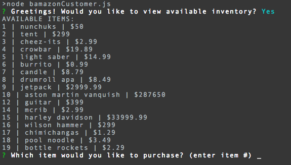

# Welcome to BAMazon, your source for BAMazing products!

## For customers: 

To get started, type 'node bamazonCustomer.js' into your terminal. You'll then be asked if you'd like to view available inventory:

If you input 'y' you'll then see all available inventory. You'll also be able to select the product you'd like to purchase.

You can then select an item, specify a quantity, and review your order before purchasing. 

It's as easy as that!

## For managers:

To get started, type 'node bamazonManager.js' into your terminal. You'll then see four options.

If you select 'View Products' you'll see all available products.

If you select 'View Low Inventory' you'll see all products with an inventory less than five.

If you select 'Add Inventory' you'll be able to add inventory to any product.

If you select 'Add New Product' you'll be able to add a brand new product.

And you're all set!

## Questions?

Call us anytime at 828-282-8282 or write us at [bamazon@globalmonolith.com](#).

## Thanks for visiting BAMazon!